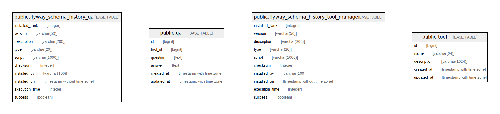

# qa

## Tables

| Name | Columns | Comment | Type |
| ---- | ------- | ------- | ---- |
| [public.flyway_schema_history_tool_manager](public.flyway_schema_history_tool_manager.md) | 10 |  | BASE TABLE |
| [public.tool](public.tool.md) | 5 |  | BASE TABLE |
| [public.flyway_schema_history_qa](public.flyway_schema_history_qa.md) | 10 |  | BASE TABLE |
| [public.qa](public.qa.md) | 6 |  | BASE TABLE |

## Relations

---

> Generated by [tbls](https://github.com/k1LoW/tbls)
