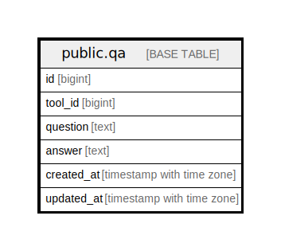

# public.qa

## Description

## Columns

| Name | Type | Default | Nullable | Children | Parents | Comment |
| ---- | ---- | ------- | -------- | -------- | ------- | ------- |
| id | bigint | nextval('qa_id_seq'::regclass) | false |  |  |  |
| tool_id | bigint |  | false |  |  |  |
| question | text |  | true |  |  |  |
| answer | text |  | true |  |  |  |
| created_at | timestamp with time zone | CURRENT_TIMESTAMP | false |  |  |  |
| updated_at | timestamp with time zone |  | true |  |  |  |

## Constraints

| Name | Type | Definition |
| ---- | ---- | ---------- |
| qa_pkey | PRIMARY KEY | PRIMARY KEY (id) |

## Indexes

| Name | Definition |
| ---- | ---------- |
| qa_pkey | CREATE UNIQUE INDEX qa_pkey ON public.qa USING btree (id) |

## Relations

---

> Generated by [tbls](https://github.com/k1LoW/tbls)
