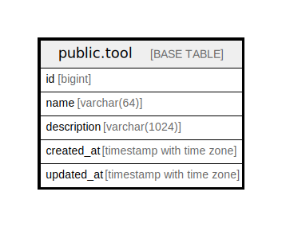

# public.tool

## Description

## Columns

| Name | Type | Default | Nullable | Children | Parents | Comment |
| ---- | ---- | ------- | -------- | -------- | ------- | ------- |
| id | bigint | nextval('tool_id_seq'::regclass) | false |  |  |  |
| name | varchar(64) |  | true |  |  |  |
| description | varchar(1024) |  | true |  |  |  |
| created_at | timestamp with time zone | CURRENT_TIMESTAMP | false |  |  |  |
| updated_at | timestamp with time zone |  | true |  |  |  |

## Constraints

| Name | Type | Definition |
| ---- | ---- | ---------- |
| tool_pkey | PRIMARY KEY | PRIMARY KEY (id) |

## Indexes

| Name | Definition |
| ---- | ---------- |
| tool_pkey | CREATE UNIQUE INDEX tool_pkey ON public.tool USING btree (id) |

## Relations

---

> Generated by [tbls](https://github.com/k1LoW/tbls)
